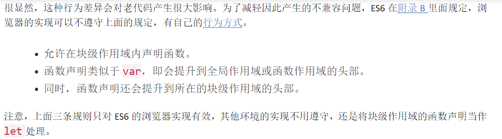
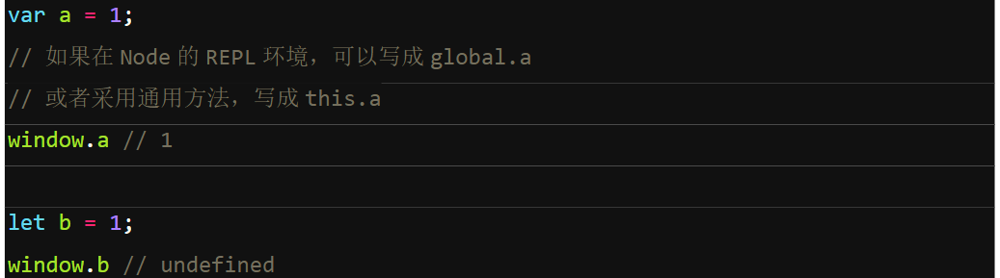

# let和const命令
## let命令
  + let声明变量，声明的变量只在所在代码块中有效
  + let不存在var那样的变量提升，所以变量一定要声明后使用
  + 暂时性死区：只要块级作用域存在let命令，其声明的变量就“绑定”此区域，不再受外部影响。
    + 注意：es6规定若区块中存在let和const，则这个区块对这些命令声明的变量，从一开始就形成封闭作用域，凡在生命前使用这些变量则报错，var不会，因为var有变量提升
    ```
    function fn () {
      console.log(name);
      console.log(age);
      var name = '1'  //undefined
      let age = 1;  //报错
    }
    ```
    + 不可重复声明：let不允许在相同作用域中，重复声明同一个变量。（var可以）
## 块级作用域与函数声明
  + es6引入块级作用域，允许在块级作用域中声明函数
  + es6规定块级作用域中的声明函数语句行为类似于let，在块级作用域外不可引用
  
  + 环境不一样不一定遵守，在块作用域中应少用声明函数，多用函数表达式。
## const命令
  + const声明一个只读常量。声明后值不可改变。（会报错，只声明不赋值也报错）
  + 和let同，只在声明所在的块作用域有效。
  + 和let类似不提升同时存在暂时性死区，只能在声明的位置后使用
  + const声明引用类型时，注意const的值是仅仅是一个地址（指向实际对象），对象本身可以改变，但const声明的常量不能赋值指向其他对象。
  + 如果想const指向的对象不可改变，应使用 Object.freeze(obj)冻结obj对象
  ```
  const foo = Object.freeze({});
  foo.name = 'name'; //常规下不起作用，严格模式报错
  ```
  + es6 一共六种变量声明：var function let const import class
## 全局对象的属性
  + 全局对象是最顶层的对象，浏览器中指window对象，node中指global对象
  + es5中全局对象的属性和全局变量等价。
  + js的缺陷：未声明的全局变量自动成为全局对象window的属性。
  + es6规定var和function命令声明的全局变量依旧是全局对象的属性，而let, const, class声明的全局变量，不属于全局对象的属性。
  
