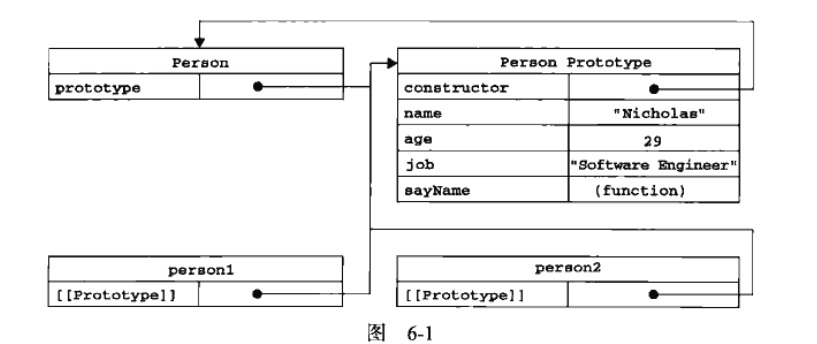
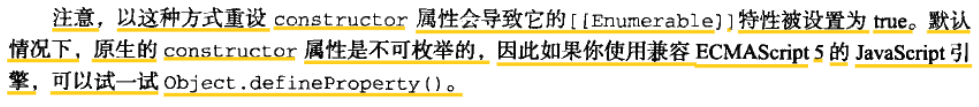
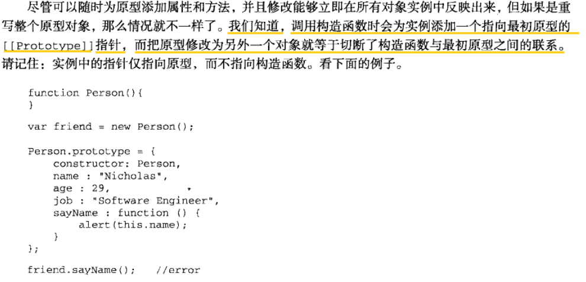
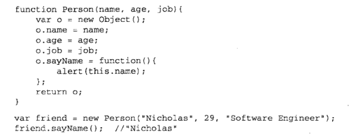
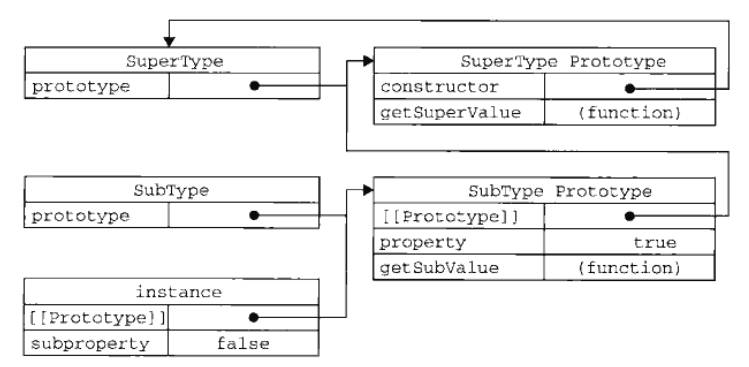

### 面向对象的程序设计
> js中对象：无序属性的集合，其属性可以包含基本值、对象或者函数

6.1.1 属性类型
  + es6定义了只有内部才用的属性（attribute）时，描述了属性(proerty)的各种特性。
  + js中有两种属性：数据属性和访问器属性
  1. 数据属性: 包含一个数据值的位置。这个位置可以读取和写入。数据属性有4个描述其行为的特性
   - [[Configurable]] ：能否delete删除属性从而重新定义属性，**能否修改属性的特性**，或能否把属性修改为访问器属性（默认true）
   - [[Enumerable]]：能否for-in循环返回属性（默认true）
   - [[writable]]：能否修改属性的值（默认true）
   - [[value]]：包含这个属性的数据值，读取属性值从这个位置读取；写入属性值时把新值保存在这个位置。（默认undefined）
   - **修改属性的默认特性，必须使用es6新增的Object.defineProperty(obj, prop, descriptor)**
```
var person = {}
//创建一个值为name1的只读属性，非严格模式下，赋值操作被忽略，严格则抛出错误
Object.defineProperty(person, 'name', {
    writable: false,
    value: 'name1'
  })
```
  - configurable设为false，则不能从对象中删除属性，**且会把属性定义为不可配置**（不可变回可配置），此时再调用Object.defineProperty()修改除了writable之外的属性都会报错。
```
var person = {}
Object.defineProperty(person, 'name', {
    configurable: false,
    value: 'n1'
})
//再调用Object.defineProperty()修改除了writable之外的属性都会报错。
Object.defineProperty(person, 'name', {
    configurable: true,
    value: 'n1'
})
```
   - 调用Object.defineProperty(),若不指定，configurable,enumerable和writable属性则默认为false
```
var person = {}
Object.defineProperty(person, 'name', {
    writable: false,
    value: 'name1'
  })
//下面会报错因为上面没指定configurable，默认false
Object.defineProperty(person, 'name', {
    configurable: true,
    value: 'n1'
})
```
  2. 属性访问器：不包含属性值，包含一对getter和setter函数(不过非必需)，有以下四个特性
   - [[Configurable]]：（默认true）
   - [[Enumerable]]：（默认true）
   - [[get]]：读取属性时调用，负责返回有效值
   - [[set]]：写入属性时会调用并传入新值，负责决定如何处理数据
   - **访问器属性不能直接定义，必须Object.defineProperty(obj, prop, descriptor)定义**
```
var book = {_year: 2004}
Object.defineProperty(book, 'year', {
  get: function() { return this._year },
  set: function(newYear) { this._year = newYear }
});
alert(book.year);//执行getter返回_year的值
book.year = 2005;
alert(book._year);//setter修改对应的值
```
   - 不一定同时指定getter和setter，但若只指定getter则不能写，写入会忽略，只设置setter同理

6.1.2 定义多个属性：Object.defineProperties()
   + 一次可添加多个属性的特征
```
var book = {}
Object.defineProperties(book, {
  _year: {
    writable: true;
  },
  year: {
    get: function() {...},
    set: function(val) {...}
  }
  })
```
6.1.3 读取属性的特征: Object.getOwnPropertyDescriptor(obj, 属性名),返回属性的描述符（数据属性或访问属性）
```
var descriptor = Object.getOwnProertyDescriptor(book, _year);
alert(descriptor.configurable)
```

6.2 创建对象
6.2.1 工厂模式：用函数封装特定接口创建对象的细节
```
function createPerson(name, job) {
  var o = new Object();
  o.name = name; o.job = job;
  o.say = ()=>{....};
  return o;
}
var person1 = createPerson('n1', 'j1');
var person1 = createPerson('n2', 'j2');
```
6.2.2 构造函数模式
  + 大写字母开头,使用new操作符（任何函数通过new来调用，则可以作为构造函数）
  + 创建自定义的构造函数意味着它的实例可以标识未一种特定类型，这是构造函数模式胜过工厂的地方
```
function Person(name, job) {
  this.name = name; this.job = job;
  this.say = ()=> {.....};
}
var person1 = new Person('n1', 'j1');
alert(person1 instanceof Person) //true
alert(person1.constructor == Person) //true,作用同instanceof
```
  + 缺点：每个方法都要在每个实例上重新创建一次

### 6.2.3 原型模式
> 每个函数都有一个prototype(原型)属性, 这个属性是一个指针，指向一个对象，而这个对象包含可以由特定类型的所有实例共享的属性和方法
#### 6.2.3.1 了解原型
  1. 创建一个新**函数对象**(并非所以有对象)就会创建一个prototype属性（指向函数的原型对象）。默认下所有原型对象(prototype指向的对象)都会有一个constructor属性，该属性指向prototype对象所在的函数。
  
  2. 构造函数创建一个新实例后，实例的内部包含一个指针（内部属性[\[prototype\]],没有标准的访问方式，浏览器中用\_\_proto\_\_访问，es6可通过Object.getPrototypeOf(instance)访问）
  3. 对象实习可以访问原型对象的值，但不能通过实例重写原型中的值，因为如果在实例中添加一个和原型对象同名的属性，就会在实例中创建属性而不会根据原型链找到原型中的值。（用delete操作符才能删除）
  ```
  function Person() {};
  var person1 = new Person();
  Person.prototype.name = '12';
  console.log(person1.hasOwnProperty('name')); //false,判断对象自身有无该属性，不包括原型链
  person1.name = '111'
  console.log(person1.hasOwnProperty('name')); //true
  delete person1.name; //删除实例中的属性，不可删原型中
  console.log(person1.hasOwnProperty('name')); //false
  ```
    - 注意： es6中Object.getOwnPropertyDescriptpr()只能用于获取实例属性的描述符，要获得原型属性的描述符，应直接再原型对象上调用
#### 6.2.3.2 原型和in操作符
  + in操作符两种使用：1.单独使用2.for-in中循环使用
    1. 单独使用，对象能访问的属性返回true，无论是实例还是原型中,in和hasOwnProperty()同时使用可以判断属性是原型还是自身对象中。
    ```
    function Person() {};
    var person1 = new Person();
    Person.prototype.name = '12';
    console.log('name' in person1); //true
    person1.age = 20;
    console.log('age' in person1);  //true
    //注意左边是属性名字符串
    ```
    2. for-in
      + for-in 找到对象可访问的和可枚举的属性（包括原型）
      + Object.keys() 数组形式返回自身可枚举属性的属性名（不包括原型）
      + Object.getOwnPropertyNames() 数组形式返回自身所有属性的属性名，包括不可枚举的（不包括原型）
      + Object.keys(), Object.getOwnPropertyNames() 可以代替for-in
#### 6.2.3.3 更简单的原型语句 （少用参见下一条）

  ```
  var Person = function() {}
  Person.prototype = {
    //这样定义prototype本质上重写了prototype，要自定义constructor
    //因为这样定义prototype本质上重写了constructor，即constructor不再指向Person
    constructor: Person,
    name: 'name',
    age: 'age',
  }
  //让constructor变为不可枚举
  Object.defineProperty(Person.prototype, 'constructor', {
      enumerable: false
    })
  ```
#### 6.2.3.4 原型的动态性
  + 对原型对象的修改都可以立即从实例上反映

  
#### 6.2.3.5 原生对象的原型
#### 6.2.3.6 原型对象的问题
  1. 共享引用类型值的问题
### 6.2.4 组合使用构造函数和原型模式
> 构造函数用于定义实例属性， 原型模式用于定于方法和共享属性。

### 6.2.5 动态原型模式 （建议不重写原型）
### 6.2.6 寄生构造函数模式
> 思路：创建一个函数，该函数作用仅仅是封装创建对象代码，然后再返回新建的对象，从表面看像构造函数


  + 注意：返回的对象与构造函数或者与构造函数的原型属性没有关系，即构造函数返回的对象与再狗仔函数外部直接创建的对象没有区别，所以不能依赖instanceof操作符来确定对象类型。
### 6.2.7 稳妥构造数模式（与寄生构造函数模式类似，不能依赖instanceof操作符来确定对象类型）
> 稳妥对象：没有公共属性，而且其方法也不引用this对象。适合在安全环境中（禁止使用this，new）或防止数据被其他应用程序改动时使用。

```
function Person(name, age) {
  var o = new Object();
  o.say = function() {
    console.log(name);
  }
  return o;
}
var p1 = Person('name');
p1.name = 'p1';
p1.say(); //name而不是p1，注意自由变量
```
## 6.3 继承
### 6.3.1 原型链
  + 原型链是实现继承的主要方法
  + 基本思路：利用原型让一个引用类型继承另一个引用类型的属性和方法。（如：原型对象等于另一个类型的实例）
```
function sup() {this.sup = true;}
sup.prototype.getSuper = function() {return this.sup;}
function sub() {this.sub = false;}
sub.prototype = new sup();
sub.prototype.getSub = function() {return this.sub;}
var instance = new sub();
console.log(instance.getSuper());
```

  + 确定原型和实例的关系
    + instanceof
    + isPrototypeOf: 例子: SuperType.prototype.isPrototypeof(instance) //true/false
  + 谨慎地定义方法：给原型添加方法的代码一定要放在替换原型（继承）的语句之后。
  + 原型链的问题：
    + 继承时原型变为另一个类型的实例，则实例的属性也成为原型属性
    + 创建子类型的实例时，不能向超类型的构造函数中传递参数，即不能在不影响所有对象实例的情况下，给超类型的构造函数传递参数
### 6.3.2 借用构造函数
