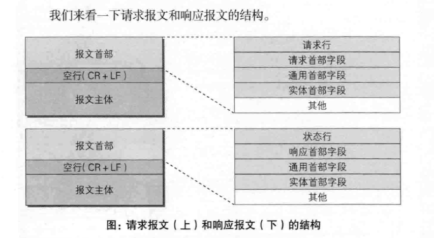

# http报文内的http信息
## 3.1 HTTP报文
  + 用于HTTP协议交互的信息，分为请求报文和响应报文两种。
  + HTTP报文本身时由多行数据构成的字符串文本
  + 报文大致由报文首部和报文主体两块组成。
    - 首部：服务器或客户端需要处理的请求或响应的内容以及属性
    - 主体：应被发送的数据
    - 
## 编码提升传输速率
### 3.3.1 报文主体和实体主体的差异
  + 报文（message）： HTTP通信中的基本单位，8组字节流组成，通过HTTP通信
  + 实体（entity）： 作为请求或响应的有效载荷数据被传输，其内容由实体首部和实体主体组成
    + 报文主体用于传输请求或响应的实体主体。（一般报文主体等于实体主体）
### 3.3.2 压缩传输的内容编码
  + 内容编码指明应用在实体内容上的编码格式，并保持实体信息原样压缩。
  + 内容编码后的实体由客户端接收并负责解码
  + 常用的内容编码: gzip(GNU zip), compress, deflate, identify
### 3.3.3 分割发送的分块传输编码
  + 传输大量数据时，通过把数据分割成多块，让浏览器逐步显示页面。（分块传输编码）
## 3.4 发送多种数据的多部分对象集合
## 3.5 获取部分内容的范围请求
  + 防止网络中断时，请求要从头开始，需要一种可恢复的机制（即从之前下载中断处恢复下载）
  + 实现该功能需要指定下载的实体范围，指定范围发送的请求叫范围请求。
## 3.6 内容协商返回最适合的内容
  + 指：客户端和服务端就响应的资源内容进行交涉然后提供给客户端最适合的资源
  + 服务器驱动协商
  + 客户端驱动协商
  + 透明协商
