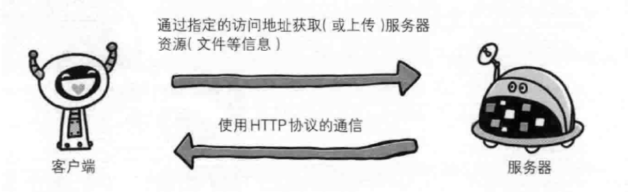
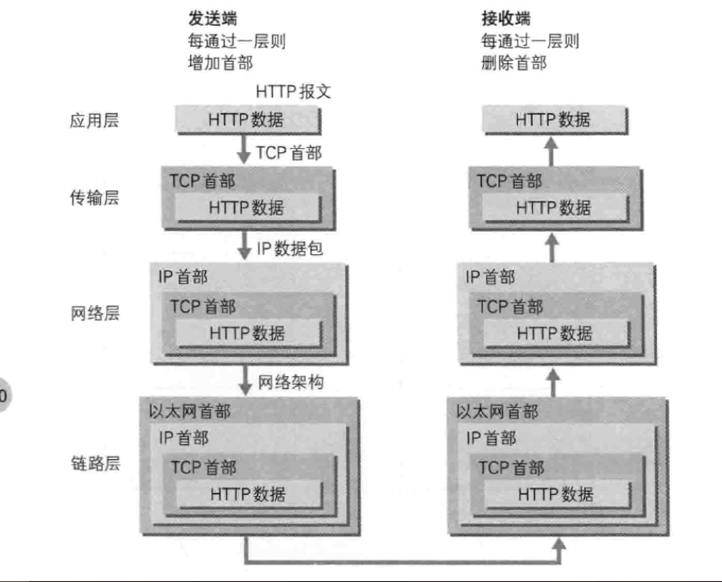
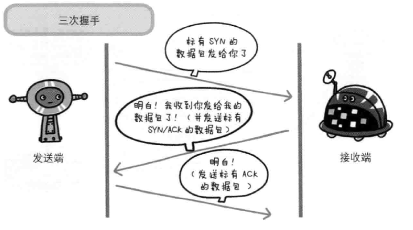
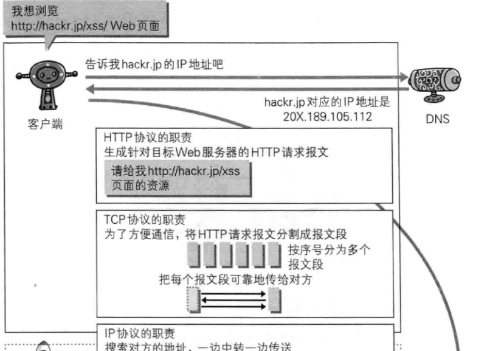
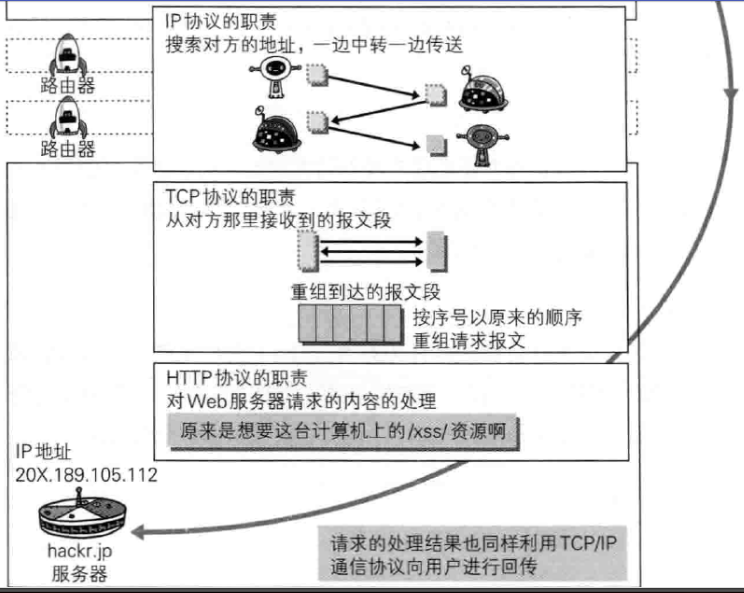
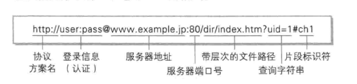

# 了解Web以及网络基础

## 1.1 使用http协议访问web
 + 客户端通过指定的访问地址(URL)获取服务器资源或上传文件信息
 + 使用的是http通信协议（超文本传输协议）
 + url：统一资源定位符

 

## 1.3 网络基础 TCP/IP
### 1.3.1 TCP/IP协议族
  + 计算机和互联网设备通信，双方要基于相同的方法、规则（我们称为协议）。
  + TCP/IP是一组协议的代名词，包括许多别的协议，组成了TCP/IP协议簇。其中比较重要的有SLIP协议、PPP协议、IP协议、ICMP协议、ARP协议、TCP协议、UDP协议、FTP协议、DNS协议、SMTP协议等

### 1.3.2 TCP/IP的分层管理
  + TCP/IP协议族中最重要的一点是分层,分为: 应用层、传输层、网络层、数据链路层
  + 分层的好处：
    1. 若互联网只由一个协议统筹，某个地方要改变设计则要吧整体替换掉，而分层只需把变动的层替换掉
    2. 各层之间的接口规划好后，每个层次内部的设计就可以自动改动
  + **应用层**: 决定了向用户提供服务时通信的活动
 TCP/IP协议族内预存了各种通用的应用服务，如：FTP(file transfer protocol文件传输协议)和DNS(域名系统)。**HTTP协议也处于该层**
  + **传输层**: 对上层应用层提供处于网络连接中的两台计算机之间的数据传输
 传输层中由两个性质不同的协议：TCP（transmission control protocol传输控制协议）和UDP（user data protocol用户数据报协议）
  + **网络层（网络互联层）**: 处理网络上流动的数据包
    - 数据包是网络传输的最小数据单位
    - 网络层规定了通过怎样的路径（即传输线路）到达对方计算机，并把数据包给对方
    - 与对方计算机之间通过多台计算机或网络设备进行传输时，网络层的作用是在众多的选项中选择一条传输线路
  + **链路层（数据链路层、网络接口层）**: 处理连接网络的硬件部分
  包括控制操作系统、硬件的设备驱动、网卡以及光纤等物理可见部分。硬件上的范畴均处于链路层中。

### 1.3.3 TCP/IP 通信传输流
  + 举例：
    1. 首先发送端的客户端在应用层（http协议）发出一个想看某个web页面的请求。
    2. 为了方便传输，在传输层（TCP协议）把从应用层收到的数据（http请求报文）进行分割，并在各个报文上打上标记以及端口号后转发给网络层。
    3. 在网络层（IP协议）增加作为通信目的地的MAC地址后转发给链路层。这样发往网络的通信请求就准备齐全了。
    4. 接收端的服务器在链路层接收到数据，按序往上发送，一直到应用层，到此才算真正接收到客户端发来的HTTP

    
  + 发送端在层与层之间传输数据时，每过一层必定打上一个该层所属的首部信息。反之，接收端在层与层传输数据时，每经过一层时会把对应的首部消息消去
  + 这种把树包装起来的做法叫封装。

## 1.4 与HTTP关系密切的协议：IP, TCP和DNS

### 1.4.1 负责传输的IP协议（internet protocol网际协议）
  + 几乎所有使用网络的系统都会用到IP协议。TCP/IP协议族中IP就是网际协议（不是IP地址）
  + **IP协议的作用是把各种数据传送给对方**而且要保证到确实传送到对方则要满足各类条件，其中**重要的两个条件**是：
    1. **IP地址** （Internet Protocol Address，又译为网际协议地址）IP协议提供的一种统一的地址格式，为互联网的每一个网络和每一台主机分配一个**逻辑地址**，以此来屏蔽物理地址的差异。
    2. **MAC地址**（Media Access Control媒体访问控制，或称为**物理地址、硬件地址**）网卡所属的固定位置，用来定义网络设备的位置。
    3. 注意：IP地址可以和MAC地址配对。IP地址可以变换，但mac地址基本不会更改。
  + 使用ARP协议凭借MAC地址进行通信
    - IP间的通信依赖MAC地址。
    - 在网络上，通信的双方在同一局域网（LAN）中是很少的，通常是经过多台计算机和网络设备中转才能连接到对方。
    - 中转时，会利用到下一站中转设备的MAC地址来搜索下一个中转目标。这时就会用ARP协议（address resolution protocol地址解析协议）
    - ARP协议：一种地址解析协议，根据对方IP地址反查出对应的MAC地址。
  + 到达通信目标前的中转过程中，计算机和路由等网络设备只能获取很粗略的传输线路，这种机制称为路由选择
### 1.4.2 确保可靠的TCP协议
  + TCP协议属于传输层，提供可靠的字节流服务
    - 字节流服务是指：为了方便传输，将大块数据分割成报**文段为单位的数据包**进行管理。
    - TCP协议是为了更容易传送大数据才把数据分割，而且能确认数据是否传送到达对方。
  + 确保数据能到达目标，为了此目的TCP协议采用了三次握手策略
    - 若握手过程中某个阶段莫名中断，TCP协议会再次以相同顺序发送相同数据包
    - 握手过程使用了TCP标志（flag）——SYN（synchronize同步）和ACK（acknowledgement确认）
    - 例子：
      + 发送端首先发送一个带SYN标志的数据包给对方。
      + 接收端收到后，返回一个带有SYN/ACK标志的数据包来传达确认信息
      + **最后** 发送端再**传回一个带有ACK标志的数据包**，表示握手结束

      

    - 除了上述的三次握手，TCP协议还有其他手段来保证通信的可靠性。

## 1.5 负责域名解析的DNS服务
  用户一般通过主机名和域名访问对方计算机而不是ip地址，DNS协议通过域名查找IP地址或逆向通过IP反查域名。

## 1.6 各种协议和HTTP协议的关系
  + 简述：
    - 客户端
      1. DNS协议负责：通过户输入想访问的域名返回对应的IP地址
      2. HTTP协议负责：生成针对目标web服务器的HTTP请求报表
      3. TCP协议负责：为方便通信，将HTTP报文分割成报文段，并把报文段可靠地传给对方
      4. IP协议负责：搜索对方地址，一边搜索一边中转。
    - 服务端
      1. TCP协议：收到报文段，重组请求报文
      2. HTTP协议：表明请求的内容的处理
  
  

## 1.7 URI（uniform resource identifier统一资源标识符）和 URL（uniform reaource locator统一资源定位符）
  + URL：访问web页面时输入的网页地址
### 1.7.1 URI（统一资源标识符）
  + uniform：规定统一的格式方便处理不同类型资源，而不用根据上下文环境来识别资源指定的访问方式。
  + resource：资源的定义是“可标识的任何东西”。
  + identifier：可标识的对象。
  + 综上：URI是由某个协议方案表示的资源定位标识符。协议方案是访问资源所使用的协议类型名称（http, ftp, mailto等）。
  + **对比：**URI标识某一互联网资源，URL标识资源的地点，可见URL是URI的子集。
### 1.7.2 URI的格式
  
