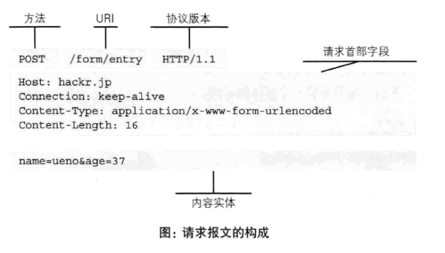
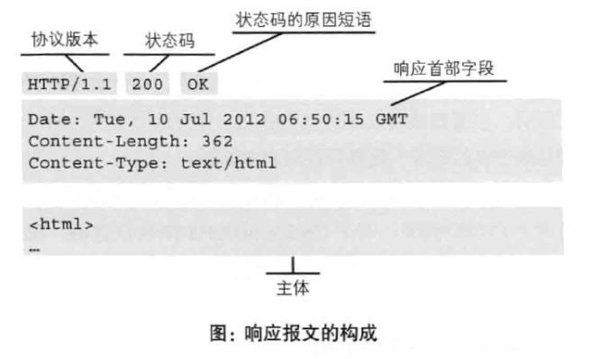

# 简单的HTTP协议
## 2.1 HTTP协议用于客户端和服务器之间的通信
  + 应用HTTP协议时，必定一端是服务器，一端是客户端
## 2.2 请求和响应的交换达成通信
  + 请求必定从客户端发出，由服务器响应请求并返回
    + 请求报文的构成：请求方法 + 请求URI + 协议版本 + 可选的请求首部字段 + 内容实体
    
    + 响应报文的构成：协议版本 + 状态码 + 解释状态码的原因短句 + 可选的响应首部字段 + 实体主体
    
## 2.3 HTTP是不保存状态的协议
  + 每当由新请求就有新响应，协议本身不保留之前的请求或响应的报文信息
## 2.4 请求URI定位资源
  + HTTP协议使用URI定位互联网的资源
## 2.5 告知服务器意图的HTTP方法
  1. GET：获取资源
  2. POST：传输实体主体
  3. PUT：传输文件
  4. HEAD：获得报文首页
  5. DELETE：删除文件
  6. OPTIONS：询问支持的方法
  7. TRACE：追踪路径
  8. CONNECT：隧道协议连接代理

## 2.8 使用Cookie的状态管理
> cookies技术通过在请求和响应报文中写入cookies信息来控制客户端状态

  1. cookies**根据服务器**发送的响应报文内的一个叫Set-Cookie的首部字段信息，通知客户端保存Cookies。
  2. 当客户端下次再向该服务器发送请求时，客户端会自动再请求报文加入Cookie后发出
  3. 服务器发现客户端发来的Cookies后检查来自什么客户端然后和服务器的记录对比获得之前的状态信息。
