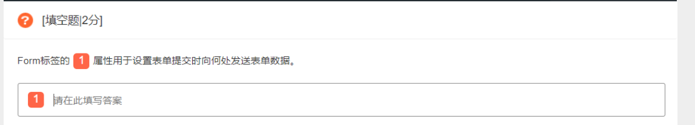
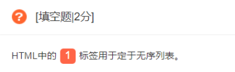
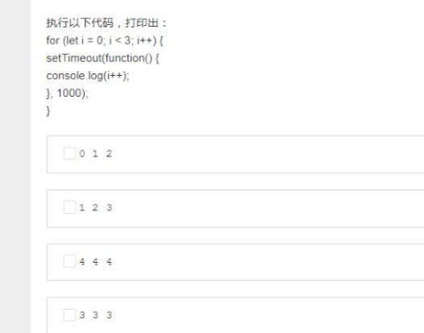

## 填空题
### 1.

Form标签的action属性用于设置表单提交时向何处发送表单数据。
### 2.


HTML中ul标签用于无序列表
无序列表始于\<ul\>标签，每一个列表项始于\<li\>
无序列表
```
<ul>
  <li>1</li>
</ul>
```
有序列表始于\<ol\>标签，每一个列表项适于\<li\>
```
<ol>
  <li></li>
</ol>
```
自定义列表（项目及其注释的组合）
自定义列表始于\<dl\>，每个自定义项以\<dt\>开始。每个自定义列表项的定义以\<dd\>开始
```
<dl>
  <dt>定义定义项目</dt>
  <dd>定义定义的描述</dd>
</dl>
```
### 3.
设置圆角的样式属性: border-radiius
### 4.
css3中设置box-sizing，可以改变默认盒子模型计算方式
+ box-sizing: content-box;(W3C标准的)
  **外盒**大小（元素空间大小）
  Element空间宽/高 = margin + border + padding + content宽/高
  **内盒**大小（元素大小）
  Element宽/高= border + padding + + content宽/高
+ box-sizing: border-box;(IE的)
  **外盒**大小（元素空间大小）
  Element空间宽/高 = margin + content宽/高
  **内盒**大小（元素大小）
  Element宽/高 = content宽/高(包含了元素内容宽高、边框、内边距)
### 5.
Array常考方法:
+ push(newelement1,newelement2,....,newelementX): arr尾部添加一个或多个元素
+ pop(): 删除并返回**最后一个**元素
+ shit(): 删除并返回**第一个**元素
+ unshit(newelement1,newelement2,....,newelementX): arr头部添加一个或多个元素
### 6.
正则表达式元字符（含\\）\D用于匹配一个非数字字符
### 7.
js中apply()和call()用于改变this指向。
调用一个对象的一个方法，以另一个对象替代当前对象
+ apply([thisObj\[,argArray\]])
+ call([thisObj\[,arg1, arg2..., argN\]])
### 8. typeof
类型 | 结果
:----:|:----:
undefined | undefined
null | object
boolean | boolean
string | string
Symbol(es6新) | symbol
函数对象 | function
任何其他对象 | object

基本类型： undefined null boolean string symbol（值在栈内存）
引用类型：function array object（值在堆内存，地址在栈内存）

### 9. http状态码
#### 2XX 成功
200 请求正常处理
204 请求处理成功，但无资源返回
206 对资源某一部分的请求
#### 3XX 重定向
301 永久重定向，请求资源已经分配到新的URI
302 临时重定向
303 类似302，但303要求客户端应采用GET访问新的URI获取资源
304 （和重定向无关）客户端应该发送附带条件的请求，服务器允许请求资源，但是条件未满足则返回304。
307 临时重定向，post不可变为get请求
#### 4XX 客户端错误
400 参数错误
401 表示请求要通过http认证的认证信息，若之前已经发送过一次，则认证失败
403 服务器拒绝访问
404 没有此资源
#### 5XX 服务器错误
500 服务器内部出错
503 服务器暂时超负荷或者停机维护，无法处理请求

### 10. html大于号（>）的转义编码
小于< \&lt 大于> \&gt

## 选择题
### 1. 属于Audio/Video的方法
+ audio对象方法
  - addTextTrack() 向音频添加文本轨道
  - canPlayType() 检查浏览器是否能播放此音频类型
  - fastSeek() 指定播放时间
  - getStartDate() 表示当前时间偏移量
  - load() 重新加载
  - play() 开始播放
  - pause() 暂停
+ video对象方法
  - addTextTrack()
  - canPlayType()
  - load()
  - play()
  - pause()

### 2. css权值问题
内联选择器> ID选择器> 类/伪类/属性选择器> 元素/伪元素选择器

### 3.

### 5. array的遍历
+ .some() 某一个为true，则返回true
+ .foreach() 相当于普通循环，无法break跳出
+ .map() 返回每个元素返回值的集合
+ .filter() 得到返回值为true的集合
+ .every() 某一为false则返回false
+ .reduce([callback, initalValue])  接受一个函数作为累加器，数组中每个值从左到右开始缩减，最终成为一个值，可以有初始值。

### 6. 支持正则表达式的String对象的方法（4个）
replace split match split

### 7. josn格式字符串转为json对象的方法
JSON.pase(str)
eval(str)
(new Function("return " + str))()

### 8.重要题目之一
0 1 2


### 9.
http请求方法：get head post put delete connect trace patch

### 10. Object.defineProperty(obj, prop, descriptor)中descriptor参数可以设置的属性
configurable
enumerable
value
writable
get/set
